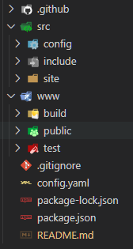

# My Own Hugo Scaffold 
## Sandalone

### An npm managed hugo scaffold

This scaffold allow for a clean, organised content management, separated from the main configuration. It's managed from the very beginning by npm, to allow for remote building and deploying with no troubles due to versions mismatch or breaking changes. Being coupled by the node ecosystem, it also allow to extend the already brilliant hugo pipes with complementary tasks.

This is the standalone version, for website which uses custom themes embedded directly in the main code.

#### Folders Tree

When first cloned, the scaffold folders tree should appear as the above image (for the gorgeous matching icons, just install [vscode-icons-team.vscode-icons](https://marketplace.visualstudio.com/items?itemName=vscode-icons-team.vscode-icons)):

- .github/ 
- src/
 server/
- .gitignore
- config.yaml
- package-lock.json
- package.json
- README.md (the file you are reading...)

#### .github
Files related to the github repo.

#### server/build
This folder will receive the hugo static build during the development stage. It's mainly to check what's really is copied to the server root, and how. 

#### server/publish
This should be the final hugo output; anyway, if you use post-processing tools, this is where they'll put their output. In both situation, this is the content which should be uploaded to the server.

#### server/test
Someone like to have a staging building, which can be post processed by tools, or for the most exotic and clever needs. That why this folder exists.

##### src
This contain hugo sources, as well as assets, images and whatever will contribute to the website. It's organized in, at least, three main folders:
- **config**
- **include**
- **site**

###### src/config
In my hugo scaffold, configuration is spread on more than on file - all of them YAML, which I found a good compromise between the too much redundant TOML and the slighlty too machine friendly JSON - and have three overrides for the three output folders you saw in the root of the repo.
- **_default**: it contains all configuration which are needed to build the website.
- **_types**: this is what usually is the archetypes folder. I found strange to have it mixed with the content, as it's mainly a collection of presets to create new content. In my understanding, it belong to the configuration of the site, so it appears here.
- **build**: here we can overrides everything is needed to produce our local, static rendering.
- **test**: this is an optional folder. It shoudl contains overrides needed for the deploy stage, if needed.
- **public**: here we define final overrides, such as base url and everything must be adjusted for the site to be correctly served.

##### include
Under include we'll find:
- **assets**: contains all files which are processed by hugo pipes - sass, images... 
- **static**: any file which do not need any processing, lives here
- **themes**: this is where I put themes, when needed

##### site
Finally, the site folder, where content sources lives:
- **content**: pages, posts, etc...
- **data**: data folder
- **layouts**: setup and overrides for content types
- **locales**: translations ('*i18n*' is just horrible, but it's the same...)

### NPM Tasks
In the master branch there are some tasks preconfigured:
- **test**, which run hugo in dryrun, just to check if the configuration is correct
- **h:s**, an alias for *hugo:serve*
- **hugo:serve**, which run hugo in live reload/watching mode
- **h:b**, an alias for *hugo:build*
- **hugo:build**, which build a local static rendering of the website, for inspection purpouse
- **h:t**, an aliasfor *hugo:test*
- **hugo:test**, which populate the /deploy folder
- **h:p**, an alias for *hugo:public*
- **hugo:public**, which, finally, produce the final render of the website, ready to be published in your server root.
- **clean:build**, clean everything under build/
- **clean:test**, clean eveything under test/
- **clean:public**, clean everything under public/
- **clean:all**, clean everything!
- **deploy**, publish the rendered website.

